#  ASC Framing Decision List  (ASC FDL)

## THE AMERICAN SOCIETY OF CINEMATOGRAPHERS
### Advanced Data Management Subcommittee

Specification v2.0.1

February 28, 2026

# Table of Contents
- [Change Log](#0-change-log) — Section 0
- [Introduction](#1-introduction) — Section 1
- [Scope](#2-scope) — Section 2
- [Conformance Notation](#3-conformance-notation) — Section 3
- [References](#4-references) — Section 4
- [Concepts and Semantics](#5-concepts-and-semantics) — Section 5
  - ASC FDL
  - Locating ASC FDL Files
  - Applying ASC FDL Files
- [ASC FDL File Properties](#6-asc-fdl-file-properties) — Section 6
  - [Schema](#61-schema)
  - [Character Encoding](#62-character-encoding)
- [Classes](#7-classes) — Section 7
  - Header
  - Framing Intents
  - Contexts
  - Canvases
  - Framing Decisions
  - Canvas Template
- [Appendix](#8-appendix) — Section 8
  - Appendix A-E: Example ASC FDL JSON Files
  - Appendix F: Example ASC FDL in an ALE
  - Appendix G: Example ASC FDL in the Header of a File
  - Appendix H: ASC FDL in an EDL

# 0. Change Log

**February, 2026**

1. Specification updated to **v2.0.1**  
2. Added minimum value: 0 to dimension and anchor point attributes  
3. **Section 7.4.1** clarification of order of operations in applying `canvas_templates`   
4. **Section 7.4.7** further clarification on `fit_method` behavior  
5. **Section 7.4.8** added describing `alignment_method` attributes  
6. **Section 7.4.9** changed `preserve_from_source_canvas` default value to: omit  
7. Updated Section Headers and Numbering  
8. Cleaned up JSON formatting
9. Corrected appendice numbering in TOC

**July 31, 2025**

9. Specification updated to **v2.0**  
10. Sections renumbered to better reflect hierarchical structure.  
11. **Section 6.1** updated to include User-Defined Properties   
12. **Section 7.2.4** clarified float data for `framing_intent.protection`  
13. **Section 7.3.3 added** to introduce the optional `clip_id` field and associated attributes  
14. **Section 7.3.4.10.5** reworded to remove the dependency on `effective_dimensions`  
15. **Section 7.4.7** clarifications on `fit_method` behavior  
16. General updates and clean up.  
17. Table of Contents corrected  
18. Version updated to {"major": 2, "minor": 0} in JSON sample data  
19. References updated  
20. Appendixes updated

**January 23, 2024**

1. JSONPath addresses added into section headers: 7.1, 7.2, 7.3, 7.4, 7.5 & 7.6 for easier understanding of where each attribute is placed within an FDL.  
2. **Section 7.2.4** *Framing Intent Protection* has been reworded, to have the framing intent protection scale inward from the Canvas, vs outward from a Framing Decision. This also matches the reference files previously provided.  
3. Version updated to {"major": 1, "minor": 1} in JSON sample data.  
4. Specification updated to **v1.1**

**February 21, 2023** - **v1.0** Specification released

# 1. Introduction

ASC FDLs are a set of instructions for how to view media in any application. The ASC FDL provides a mechanism to document framing decisions through all phases of a project’s life cycle, from pre-visualization through post-production. The FDL can exist in the form of a sidecar JSON file, or embedded into another data structure like camera original files. Any time an application is rendering media to go to another department or person, an accompanying set of ASC FDL data should be created to inform how to view the newly generated content. This ASC FDL data can be applied to view the intended framing.

# 2. Scope

This document specifies format definitions and operations for the ASC Framing Decision List (ASC FDL), for the exchange and creation of framing data. This document also contains the information required to implement an “ASC FDL-compliant” software/hardware system.

The ASC FDL is intended for use in media production workflows and has been optimized to support a department or person's ability to easily recreate framing made by others while limiting human error and the traditional operational burden. A common example is when an image author makes on-set framing decisions that then need to be conveyed to the vendor processing material for editing and review. Often, the processes used for re-creating that on-set framing decisions are manual and prone to human error. 

While ASC FDL can track framing decisions per shot, tracking per frame is currently out of scope. 

# 3. Conformance Notation

Normative text is text that describes elements of the design that are indispensable or contains the conformance language keywords: "must", "shall", "should", or "may". Informative text is text that is potentially helpful to the user, but not indispensable, and can be removed, changed, or added editorially without affecting interoperability. Informative text does not contain any conformance keywords.

All text in this document is, by default, normative, except: the Introduction, any section explicitly labeled as "Informative" or individual paragraphs that start with "Note:”

The keywords "must", "shall", and "shall not" indicate requirements strictly to be followed in order to conform to the document and from which no deviation is permitted.

The keywords, "should" and "should not" indicate that, among several possibilities, one is recommended as particularly suitable, without mentioning or excluding others; or that a certain course of action is preferred but not necessarily required; or that (in the negative form) a certain possibility or course of action is deprecated but not prohibited.

The keywords "may" and "need not" indicate courses of action permissible within the limits of the document. The keyword “reserved” indicates a provision that is not defined at this time, shall not be used, and may be defined in the future. The keyword “forbidden” indicates “reserved” and in addition, indicates that the provision will never be defined in the future.

Throughout this document, JSON property names, values, and code snippets are indicated using code formatting (monospace font). For example: `uuid`, `"width": 4448`, `framing_intents`. Full JSON examples are presented in fenced code blocks with JSON syntax.

# 4. References

* JavaScript Object Notation ([JSON](https://www.json.org/json-en.html))  
* Unicode Transformation Format 8-bit ([UTF-8](https://www.utf8.com/))  
* Generation of universally unique identifiers (UUIDs) and their use in object identifiers ([ISO/IEC 9834-8:2014](https://www.iso.org/standard/62795.html))  
* OpenEXR file format ([OpenEXR](https://github.com/AcademySoftwareFoundation/openexr))

# 5. Concepts and Semantics

## 5.1 ASC FDL

An ASC FDL is a self-contained file with an .fdl extension. It is formatted using [JSON](https://www.json.org/json-en.html) and does not require a specific directory structure. FDL data can also be embedded into recorded camera files or shared within other file types that support it.

## 5.2 Locating ASC FDL Files

Requiring specific folder structures, file names, or how an application may locate an FDL is not in scope for this specification. It is by design that FDL files can be managed in any directory structure and with any method a user wishes, including the documented `clip_id` fields. It is up to each implementation how they would like the user to select any FDL to be used on any shot.

## 5.3 Applying ASC FDL Files

ASC FDLs are not intended to be a set of complete render instructions, but rather instructions for how to view media within an application. It is recommended that any time an application is applying an ASC FDL to media, the `canvas.dimensions` should be compared against the resolution of the source material. If these do not match, the user should be warned that they are trying to apply an FDL that does not match the `canvas.dimensions` resolution. The `clip_id` is an additional set of optional attributes that can be used to validate the association between ASC FDL and a media file asset.

# 6. ASC FDL File Properties

## 6.1 Schema

ASC FDL Manifest File is a [JSON](https://www.json.org/json-en.html) document. The ASC FDL schema uses JSON Schema Draft 2020-12 and defines a structured format for documenting framing decisions in film production workflows. The schema enforces specific data types, required fields, and validation rules to ensure consistency across implementations.

An FDL document is a JSON object with the following top-level properties:

| Property | Type | Required | Descriptions |
| :---- | :---- | :---- | :---- |
| `uuid` | string (UUID format) | Yes | Unique identifier for the document (UUID format) |
| `version` | object | Yes | Schema version information (major, minor) |
| `fdl_creator` | string  | No | Identifies the creator of the FDL document |
| `default_framing_intent` | string (ID reference) | No | Reference to the default framing intent |
| `framing_intents` | array | No | Collection of framing intent definitions |
| `contexts` | array | No | Collection of context definitions |
| `canvas_templates` | array | No | Collection of canvas template definitions |

**User-Defined Properties:**

User-defined properties must be prefixed with an underscore (‘_’). The underscore prefix indicates a “private” property, intended for internal or proprietary use, providing additional flexibility for workflows that require custom values (e.g., identifiers, UUIDs, hashes, or UMIDs) not currently defined in the specification. However, user-defined properties are not expected to be fully recognized or implemented by all implementations.

Example using a user-defined `_vendor_asset_tag` field in `clip_id`:

```json
"clip_id": {
  "clip_name": "A002_C307_0523JT",
  "_vendor_asset_tag": "797C7CD8-4EB1-4F67-AFCE-AF2B0A1D0285"
}
```

## 6.2 Character Encoding

ASC FDL documents shall be encoded using [UTF-8](https://www.utf8.com/) character encoding.

# 7. Classes

**Description:**

ASC FDL files are organized in various sections, each containing its own set of attributes. The ASC FDL classes consist of: Header, Framing Intents, Contexts, Canvas, Framing Decisions, Canvas Template.

## 7.1 Header

**JSONPath:** `$.`

```json
"uuid": "BCD142EB-3BAA-4EA8-ADD8-A46AE8DC4D97",
"version": { "major": 2, "minor": 0 },
"fdl_creator": "ASC FDL Committee",
"default_framing_intent": "FDLSMP01",
```

### 7.1.1 uuid

**Description:**

The uuid field is a globally unique string that differentiates an individual ASC FDL file from any other. The format of the UUID must use the canonical textual representation. The 16 octets of a UUID are represented as 32 hexadecimal (base-16) digits, displayed in 5 groups separated by hyphens, in the form 8-4-4-4-12 for a total of 36 characters (32 alphanumeric characters and 4 hyphens). 

Example UUID: AFE122BE-59D3-4360-AD69-33C10108FA7A

The ASC FDL uuid attribute will utilize the **ISO/IEC 9834-8:2014** specification, enabling applications to produce 128-bit identifiers that are either guaranteed to be globally unique or are globally unique with a high probability. For more information, please see: [https://www.iso.org/standard/62795.html](https://www.iso.org/standard/62795.html)

Example:
```json
"uuid": "BCD142EB-3BAA-4EA8-ADD8-A46AE8DC4D97",
```

Data Type: string

Required Field: Yes

### 7.1.2 version

**Description:**

The ASC FDL specification may be updated over a course of time and each updated version officially released will have a version number. All ASC FDL files should contain the implementer’s ASC FDL version within the header of the ASC FDL file.

Example:
```json
"version": { "major": 2, "minor": 0 }
```

Data Type:  
`"major": integer`  
`"minor": integer`

Required Field: Yes

### 7.1.3 fdl_creator

**Description:**

This field can take a string indicating who created the FDL document. A user or implementation may choose to include the user or the software name/version that was used to create it. If any software receives an FDL and adds data to it, the `fdl_creator` field should represent the most recent modifying author when creating a new version of the FDL.

Example:
```json
"fdl_creator": "ASC FDL Committee",
```

Data Type: string

Required Field: No

Default Value: Omitted

### 7.1.4 default_framing_intent

**Description:**

Specifying a `default_framing_intent` will allow implementations to know which Framing Intent to automatically use when multiple framing intents exist within a single FDL.

The `default_framing_intent` contains the `framing_intent.id` of the primary Framing Intent.

Example:
```json
"default_framing_intent": "FDLSMP01"
```

Data Type: string

Required Field: No

## 7.2 Framing Intents

**JSONPath:** `$.framing_intents`

```json
"framing_intents": [
  {
    "label": "2.40-1 Framing",
    "id": "FDLSMP01",
    "aspect_ratio": { "width": 240, "height": 100 },
    "protection": 0.05
  }
]
```

**Description:**

Creating a Framing Intent is the first key step to creating an FDL. It represents the intended aspect ratio, unbounded by the constraints of any camera or device.  This is the region within which a cinematographer will compose content intended for the viewing audience. An FDL may contain multiple `framing_intents`.

**Child Elements:** `framing_intents.label`, `framing_intents.id`, `framing_intents.aspect_ratio`, `framing_intents.protection`

### 7.2.1 label

The label field in an FDL is a field to provide a human-readable title for a Framing Intent. 

Note: Using UTF-8 strings with non-ASCII characters may have compatibility issues with some software.

Note: An implementation may choose to show this field in its interface to allow a user to choose which framing intent from the selected FDL they would like to apply. 

Example:
```json
"label": "2.40-1 Framing"
```

Data Type: string

Required Field: No

### 7.2.2 id

The `framing_intents.id` field is meant to provide a means of identification for a `framing_intent`. This id is not universally unique, but no other `framing_intents.id` within a single FDL will use the same id. The `framing_intents.id` field shall be between 1-32 characters in length and be limited to the use of alphanumeric characters and underscores.

Example:
```json
"id": "FDLSMP01"
```

Data Type: string

Required Field: Yes

### 7.2.3 aspect_ratio

`aspect_ratio` represents the image author’s original intention. `aspect_ratio` shall utilize width and height integers. To provide an exact ratio for higher accuracy, non-integers (e.g. 1.78) are not allowed.

Example:
```json
"aspect_ratio": { "width": 4096, "height": 1716 }
```

Data Type:  
`"width": integer`  
`"height": integer`

Required Field: Yes

### 7.2.4 protection

A `framing_intent` may include a defined area for protection. This area is called `framing_intent.protection` and matches the aspect ratio of the `framing_intent`.

A protection value of 0 means there will be no `framing_intent.protection`. A value of 0.05 results in a 5% `framing_decision.protection` area calculated inward from the edge of the defined `canvas.dimensions`: 1.00-0.05 = 0.95 or 95%.

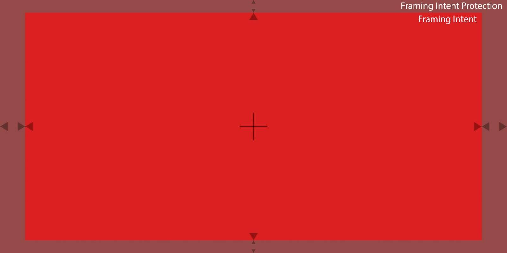

Example:
```json
"protection": 0.05
```

Data Type: float (between 0.00 and 1.00)

Required Field: No

Default Value: `0`

## 7.3 Contexts

**JSONPath:** `$.contexts`

```json
"contexts": [
  {
    "label": "ArriLF OG",
    "context_creator": "ASC FDL Committee",
    "clip_id": {
      "clip_name": "A002_C307_0523JT",
      "file": "A002_C307_0523JT.MOV"
    },
    "canvases": [ { ... } ]
  }
]
```

**Description:**

The contexts class allows image authors to provide additional information on the origin of the ASC FDL. The field's purpose is for users to manage and organize their FDL data. For example, an image author may choose to have framing data specific to a certain camera, editorial delivery, visual effects plates, etc., all separated by contexts. Another production may choose to use it to organize by camera manufacturer. The Contexts class is a JSON array designed to hold one or multiple context objects.

**Child Elements:** `contexts.label`, `contexts.context_creator`, `contexts.clip_id`

### 7.3.1 label

The label field is a user-defined field available to categorize/manage FDL data. Example: “ArriLF OG”.

Note: Using UTF-8 strings with non-ASCII characters may have compatibility issues with some software.

Example:
```json
"label": "ArriLF OG"
```

Data Type: string

Required Field: No

### 7.3.2 context_creator

The `context_creator` attribute will be populated by the application that has generated the FDL. This field represents which user or implementation has generated this specific context within the ASC FDL. There could be different `context_creator` data in each context if multiple authors contributed to an ASC FDL. It is up to the implementation as to how it formats this attribute’s values.

Example:
```json
"context_creator": "ASC FDL Committee"
```

Data Type: string

Required Field: No

### 7.3.3 clip_id

```json
"clip_id": {
  "clip_name": "A002_C307_0523JT",
  "file": "A002_C307_0523JT.MOV"
}
```

**Description:**

This field defines elements used to communicate information about the essence associated with an ASC FDL.

Required Field: No

**Child Elements:** `clip_id.clip_name`, `clip_id.file`, `clip_id.sequence`

### 7.3.3.1 clip_name

**Description:**

This element communicates the clip name associated with the media files. If `clip_id` is used, then a `clip_id.clip_name` value must be provided.

Example:
```json
"clip_name": "A002_C307_0523JT"
```

Data Type: string

Required Field: Yes (if `clip_id` is used)

### 7.3.3.2 file

**Description:**

Used to communicate the media file's name. Use caution if using file as a `clip_id` identifier as file names and locations can change during production and post-production. 

`clip_id` may only include file or sequence, not both.

Example:
```json
"file": "A002_C307_0523JT.MOV"
```

Data Type: string

Required Field: No

### 7.3.3.3 sequence

**Description:**

This element is used to communicate the file sequence information associated with the media files and has four required attributes: value, idx, min, and max. The file sequence includes an index indicated by the idx attribute (e.g. `#`) that is used to denote the location of frame numbers within the sequence string. The min and max attributes are used to indicate the minimum frame number and maximum frame number of the sequence. For example, if the sequence string is `movieFrame###.exr` and attributes of `clip_id.sequence` are idx=`#`, min=`0` and max=`100` the media files associated with the FDL would be the frames numbered `movieFrame000.exr` through `movieFrame100.exr`

This element communicates file sequence information, requiring four attributes: value, idx, min, and max. The idx attribute denotes the frame number location (e.g., `#`). The min and max attributes specify the sequence's minimum and maximum frame numbers. For example, if the sequence string `movieFrame###.exr`, idx is `#`, min is `0`, and max is `100`, the associated media files are `movieFrame000.exr` through `movieFrame100.exr`.

`clip_id` may only include file or sequence, not both.

Example:
```json
"sequence": { "value": "A01_C012_AE0306_###.exr", "idx": "#", "min": 0, "max": 100 }
```

Data Type:  
`"value": string`  
`"idx": string (single character)`  
`"min": integer`  
`"max": integer`

* Minimum: 0

Required Field: No

### 7.3.4 Canvases

**JSONPath:** `$.contexts[:].canvases`

```json
"canvases": [
  {
    "label": "Open Gate RAW",
    "id": "20220310",
    "source_canvas_id": "34256345",
    "dimensions": { "width": 4448, "height": 3096 },
    "effective_dimensions": { "width": 4006, "height": 2788 },
    "effective_anchor_point": { "x": 222, "y": 155 },
    "photosite_dimensions": { "width": 4448, "height": 3096 },
    "physical_dimensions": { "width": 36.7, "height": 25.54 },
    "anamorphic_squeeze": 1.0
  }
]
```

**Description:**

canvases define the active coordinate system of an application, file, or video stream. An application, file, or video stream could contain an additional area outside of the defined canvas, but applying an FDL to utilize that region would require a different canvas. For example, if a camera records an image file, that file's recorded resolution will be utilized as the canvas dimensions. If the camera system records a second image file in a different resolution, it will result in a new canvas. A canvas can only be generated once the system creating it understands what the recorded/generated area is going to be. 

**Child Elements:** `canvases.label`, `canvases.id`, `canvases.source_canvas_id`, `canvases.dimensions`, `canvases.effective_dimensions`, `canvases.effective_anchor_point`, `canvases.photosite_dimensions`, `canvases.physical_dimensions`, `canvases.anamorphic_squeeze`

#### 7.3.4.1 label

The label field is a user-defined field available to categorize/manage FDL canvases. 

For example: “Open gate RAW”. 

Note: Using UTF-8 strings with non-ASCII characters may have compatibility issues with some software.

Example:
```json
"label": "Open Gate RAW"
```

Data Type: string

Required Field: No

#### 7.3.4.2 id

The `canvas.id` field is meant to provide a means of identification for a canvas. The id is unique to each canvas inside of a given ASC FDL, but may not be globally unique to other ASC FDL files. The `canvas.id` field shall be between 1-32 characters in length and will allow for use of alphanumeric characters and underscores.

Example:
```json
"id": "20220310"
```

Data Type: string

Required Field: Yes

#### 7.3.4.3 source_canvas_id

ASC FDLs may be generated from original camera files or derivatives from the original camera files. Therefore the `source_canvas_id` attribute has been created to allow a user to see the canvas that was used when the original ASC FDL was created. Example, a user may have an ASC FDL for the source camera file, then render plates to be delivered to a VFX vendor scaled to a smaller resolution. A new FDL may be delivered along with these newly created media files. The new canvas id will represent the new media file (VFX plate) that was generated. However, the `source_canvas_id` would reference the initial id the new canvas was derived from. 

Any time an application creates a new FDL with a new canvas, or appends an FDL with a new canvas, it is expected that the original source canvas and its values be maintained. Therefore when a new FDL is created, both the new canvas and the source canvas it was derived from should be present within `contexts[:].canvases`.

If there is no prior knowledge of a past generation canvas, the `source_canvas_id` should be the same value as id. 

Example:
```json
"source_canvas_id": "34256345"
```

Data Type: string

Required Field: Yes

#### 7.3.4.4 dimensions

Any canvas within an ASC FDL will have a width and height defined. The dimensions field will be formatted as: `"width": 4448, "height": 3096`

Example:
```json
"dimensions": { "width": 4448, "height": 3096 }
```

Data Type:  
`"width": integer`  
`"height": integer`

Required Field: Yes

#### 7.3.4.5 effective_dimensions

A canvas can be effectively constrained to prevent a `framing_intent` and its `framing_intent.protection` from being applied outside an intended area. This is called `effective_dimensions`. For example, when a canvas contains pixels known to be unusable (e.g., padded pixels in record format, or vignetting resulting from a lens that doesn’t cover a camera’s sensor). A user may choose to constrain the usable canvas to the available region of the canvas by applying a Framing Decision within the `effective_dimensions`.


The `effective_dimensions` will define the width and height of this canvas constraint and will be written as:

`"width": 4006, "height": 2788`

Example:
```json
"effective_dimensions": { "width": 4006, "height": 2788 }
```

Data Type:  
`"width": integer`  
`"height": integer`

Units: Pixels

Required Field: No

#### 7.3.4.6 effective_anchor_point

If `effective_dimensions` is to be placed within a canvas, any implementation will require an understanding of the area to be used and where to position this area within the Canvas. The `effective_anchor_point` documents where the top left pixel of the `effective_dimensions` should be in relation to the top left pixel of the Canvas. Similarly to the `framing_decision.anchor_point`, these anchor points use **float** versus **int** values for these variables to avoid rounding issues when scaling.

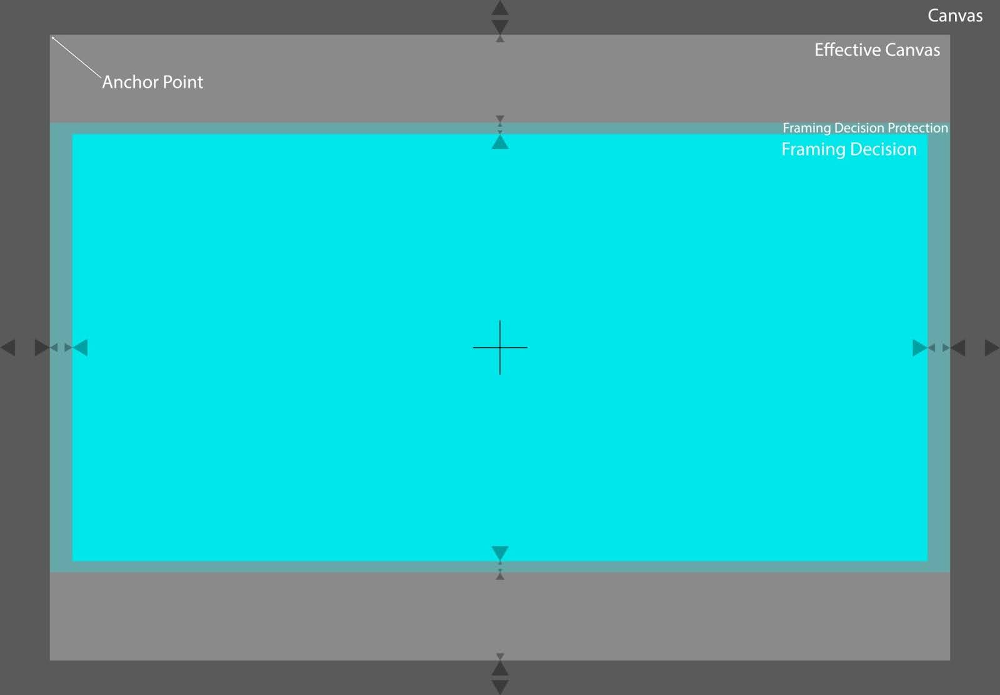

Example:
```json
"effective_anchor_point": { "x": 222.0, "y": 155.0 }
```

Data Type:  
`"x": float`  
`"y": float`

* Minimum: 0

Required Field: Yes if there is an `effective_dimensions`, otherwise No

Units: Pixels

#### 7.3.4.7 photosite_dimensions

We encourage camera manufacturers to provide this data when a camera has generated an ASC FDL canvas. We do not require any implementation to generate photosite dimensions for non physical-camera generated canvases. Example, if a camera generated a canvas it would ideally capture this attribute. However if an ASC FDL was generated with a new canvas for a VFX Plate, this attribute would not be expected to be filled. Therefore, a source canvas should have `photosite_dimensions`, but a child canvas of that source would likely not.

Example:
Arri Alexa Mini - Recording Mode: **4K UHD**  
Sensor Active Image Area:  **3200 x 1800 photosites**  
Recording File Image Content: **3840 x 2160 pixels**

Example:
```json
"photosite_dimensions": { "width": 3200, "height": 1800 }
```

Data Type:  
`"width": integer`  
`"height": integer`

* Minimum: 0

Required Field: No

Units: Photosites

Default Value: Omitted

#### 7.3.4.8 physical_dimensions

We encourage camera manufacturers to provide this data when a camera has generated an ASC FDL canvas. We do not require any implementation to generate `physical_dimensions` for non physical-camera generated canvases. Example, if a camera generated a canvas, it would ideally capture this attribute. However, if a child ASC FDL was generated from that source with a new canvas for a VFX Plate, this attribute is not mandatory. Any implementation that is reading an ASC FDL that originally contained `physical_dimensions` could calculate and generate new `physical_dimensions` values if desired. 

Note: To ensure accuracy to one-tenth of a micron, users should provide 4 decimal places.

Example:
```json
"physical_dimensions": { "width": 36.7, "height": 25.54 }
```

Data Type:  
`"width": float`  
`"height": float`

* Minimum: 0

Required Field: No

Units: Millimeters

Default Value: Omitted

#### 7.3.4.9 anamorphic_squeeze

Any application reading an FDL will need to understand if the canvas it is reading is squeezed or not. The `anamorphic_squeeze` attribute will match the image deformation numbering system that lens manufacturers use. For example, **1.3** would mean the image is currently squeezed by a ratio of 1.3:1. Or **2.0** would indicate the image has been squeezed by a ratio of 2:1. The squeeze is specifically a horizontal squeeze factor.

All applications reading an ASC FDL will apply the squeeze factor before any scaling to ensure consistency between applications. This will be critical, considering that if you apply these in a different order, you may get different results, and we want to ensure consistency between any implementation.

Note: Users must ensure they provide enough decimal places. For example, some lenses are **1.3** and some are **1.33**; these are different values.

Example:
```json
"anamorphic_squeeze": 1.0
```

Data Type: float (greater than 0)

Required Field: No

Default Value: `1`

#### 7.3.4.10 Framing Decisions

**JSONPath:** `$.contexts[:].canvases[:].framing_decisions`

```json
"framing_decisions": [
  {
    "label": "2.40-1 Framing",
    "id": "20220310-FDLSMP01",
    "framing_intent_id": "FDLSMP01",
    "dimensions": { "width": 4004.0, "height": 2002.0 },
    "anchor_point": { "x": 222.0, "y": 547.0 },
    "protection_dimensions": { "width": 4448.0, "height": 2224.0 },
    "protection_anchor_point": { "x": 0.0, "y": 436.0 }
  }
]
```

**Description:**

`framing_decisions` are the result of a `framing_intents.aspect_ratio`, and `framing_intent.protection` of a specified `framing_intent` mapped into the pixel dimensions of a particular canvas.

A `framing_intent` does not have any attributes that document its position within a Canvas, nor anything that defines its actual size in pixels. It is just a defined aspect ratio and (optional) relative protection. `framing_decisions` connected to a specific canvas will have a defined set of coordinates, so any application reading an ASC FDL can understand where the intended `framing_intent` is positioned within that canvas. 

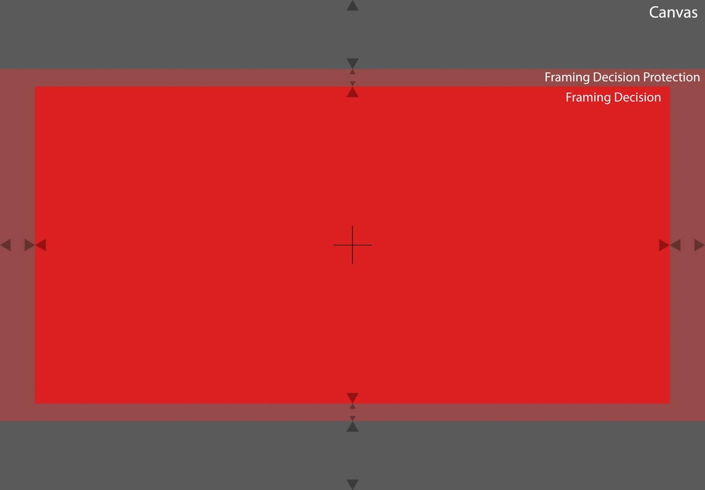

**Child Elements:** `framing_decisions.label`, `framing_decisions.id`, `framing_decisions.dimensions`, `framing_decisions.anchor_point`, `framing_decisions.protection_dimensions`, `framing_decisions.protection_anchor_points`

#### 7.3.4.10.1 label

`framing_decisions.label` is a user-defined field available to categorize/manage FDL data. Example: “2.40:1 Framing”.

Note: Using UTF-8 strings with non-ASCII characters may have compatibility issues on some software.

Example:
```json
"label": "2.40-1 Framing"
```

Data Type: string

Required Field: No

#### 7.3.4.10.2 id

Each Framing Decision will have an id field that is unique to the ASC FDL but not universally unique among other ASC FDLs.

The formatting of `framing_decision.id` will be:

`[canvas>id]` `-` `[framing_intent>id]`

Example:
```json
"id": "20220310-FDLSMP01"
```

Data Type: string

Required Field: Yes

#### 7.3.4.10.3 framing_intent_id

Including the `framing_intent_id` inside the `framing_decision` class is intended to allow for any implementation to infer which `framing_intent` a particular Framing Decision is connected to.

Example:
```json
"framing_intent_id": "FDLSMP01"
```

Data Type: string

Required Field: Yes

#### 7.3.4.10.4 dimensions

dimensions will specify the width and height of the Framing Decision now that it has been placed within a Canvas. When generating an ASC FDL, any implementation shall by default place the Framing Decision to fit within the Canvas, not cropping any of the resulting dimensions. Example, if a Canvas’ dimensions is an aspect ratio of **1.43:1**, and the `framing_intents.aspect_ratio` is **2:1**, the resulting Framing Decision would letterbox the Canvas: 

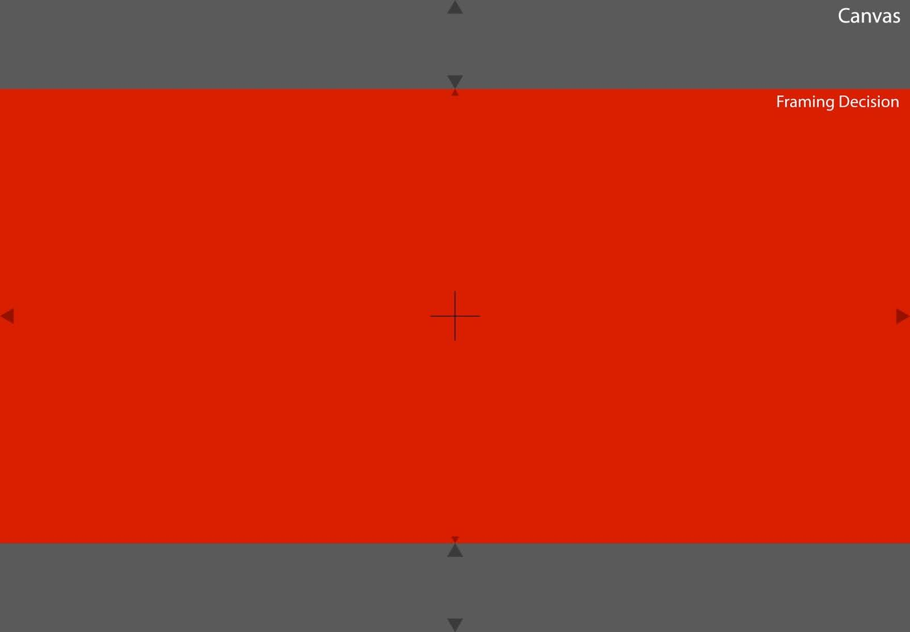

Alternatively, if the Canvas dimensions had an aspect ratio of **2.39:1**, it would be pillarboxed:

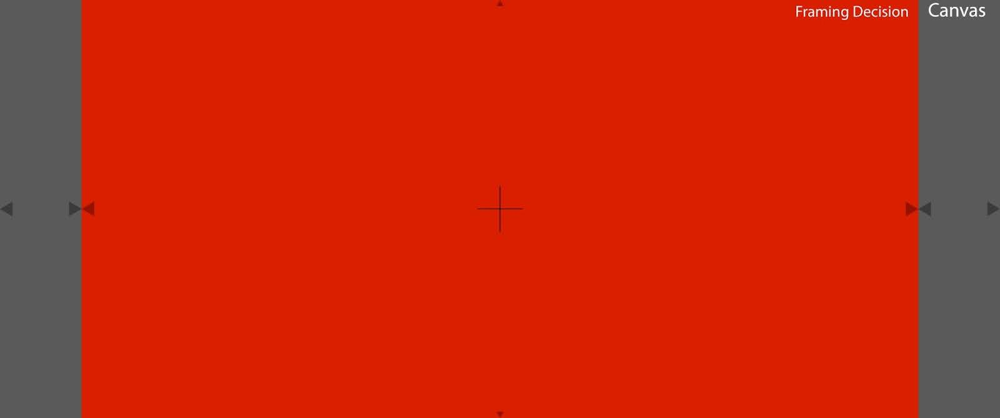

dimensions shall be formatted as float number values for higher scaling precision.  When the float values need to become integers for display purposes in any implementation, we recommend the nearest integer value.

It is possible that the Framing Decision dimensions will not match the `framing_intents.aspect_ratio` exactly. When this new FDL is read by any implementation, the Framing Decision dimensions should take precedence as the framing area applied to the resulting pixels of the associated canvas. 

Example:
```json
"dimensions": { "width": 4004.0, "height": 2002.0 }
```

Data Type:  
`"width": float`  
`"height": float`

Required Field: Yes

#### 7.3.4.10.5 anchor_point

If an application is given a dimension for the Framing Decision in pixels, it still needs to understand where to position it within the Canvas. The `anchor_point` specifies where the top left pixel of the Framing Decision’s dimension is in relation to the top left of the Canvas.

`anchor_point` uses **float** versus **int** values to avoid scaling ambiguities and rounding issues when scaling.

The first value is the number of pixels horizontally from the left side of the Canvas. The second value uses the same process, but now for the y-axis.

Example:
```json
"anchor_point": { "x": 222.0, "y": 547.0 }
```

Data Type:  
`"x": float`  
`"y": float`

* Minimum: 0

Required Field: Yes

Units: Pixels

#### 7.3.4.10.6 protection_dimensions

Similarly to the Framing Intent resulting in a Framing Decision once placed within a Canvas, the Framing Intent’s protection will result in a Framing Decision `protection_dimensions` once placed within a Canvas. This area may be utilized for example as a safety in post production to allow for slight reframing, stabilization, and more. 

If a Framing Decision has an associated `protection_dimensions`, it will be fit into the Canvas:


If `effective_dimensions` exists in the Canvas, the Framing Decision’s `protection_dimensions` would be placed within it:

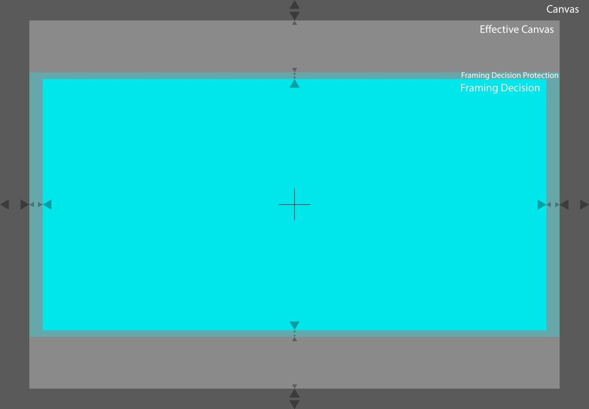

If a Framing Decision’s dimensions conflict with its referenced Framing Intent’s protection, it is permissible to override the Framing Intent’s protection to utilize the Framing Decision dimensions. 

Framing Decision `protection_dimensions` allows float number values for higher scaling precision.

Framing Decision `protection_dimensions` can be omitted if no protection is being added to the Framing Decision dimensions.

Note:  When the float values need to become integers for display purposes in any implementation, we recommend the nearest integer value.

Example:
```json
"protection_dimensions": { "width": 4448.0, "height": 2224.0 }
```

Data Type:  
`"width": float`  
`"height": float`

Units: Pixels

Required Field: Optional

#### 7.3.4.10.7 protection_anchor_point

If `protection_dimensions` is utilized, any implementation will require an understanding of the area within the Canvas to be used. Even if an application is given dimensions in pixels for this area, it still needs to understand where to position those values within the Canvas. The Framing Decision `protection_anchor_point` specifies where the top left pixel of the Framing Decision’s `protection_dimensions` is located in relation to the top left pixel of the Canvas.

The `protection_anchor_point` originates from the top left of the Canvas.

The first value is the number of pixels horizontally from the left of Canvas dimensions to the edge of the Framing Decision `protection_dimensions` (x-axis).

The second value is the number of pixels vertically from the top of the Canvas dimensions to the top of the Framing Decision `protection_dimensions` (y-axis).

The framing Framing Decision `protection_anchor_point` can be omitted if no `protection_dimensions` are being added to the Framing Decision.

Example:
```json
"protection_anchor_point": { "x": 0.0, "y": 436.0 }
```

Data Type:  
`"x": float`  
`"y": float`

* Minimum: 0

Required Field: Optional

Units: Pixels

## 7.4 Canvas Template

**JSONPath:** `$.canvas_templates`

```json
"canvas_templates": [
  {
    "label": "VFX Pull",
    "id": "VX220310",
    "target_dimensions": { "width": 3840, "height": 2160 },
    "target_anamorphic_squeeze": 1.0,
    "fit_source": "framing_decision.dimensions",
    "fit_method": "width",
    "alignment_method_vertical": "center",
    "alignment_method_horizontal": "center",
    "preserve_from_source_canvas": "canvas.dimensions",
    "maximum_dimensions": { "width": 5000, "height": 3496 },
    "pad_to_maximum": true,
    "round": { "even": "whole", "mode": "up" }
  }
]
```

**Description:**

`canvas_templates` provide a set of instructions to map an input source canvas into a newly minted output canvas. Valid ASC FDL canvases data should be used as input to a canvas template, and output canvases resulting from `canvas_templates` must follow the specifications of a canvas as defined in section 7.3.4

`canvas_templates` is optional within the ASC FDL schema, and may exist in an ASC FDL with or without `framing_intents` and canvases values.

`canvas_templates` allow for any number of source canvases and associated framing decisions used during a production to be normalized to a common output canvas, or to follow consistent rules when transformed to an output canvas. For example, a VFX Supervisor or Picture Finishing Facility may want to ensure that all plates generated for VFX work from various cameras are normalized from their input sources into a common container for delivery to vendors. They can use `canvas_templates` to create instructions for any application to properly and consistently transform any number of ASC FDL source canvases into newly minted, standardized output canvases.

**Example:**

|  |  |  |  |
|---|---|---|---|
| **Source** | 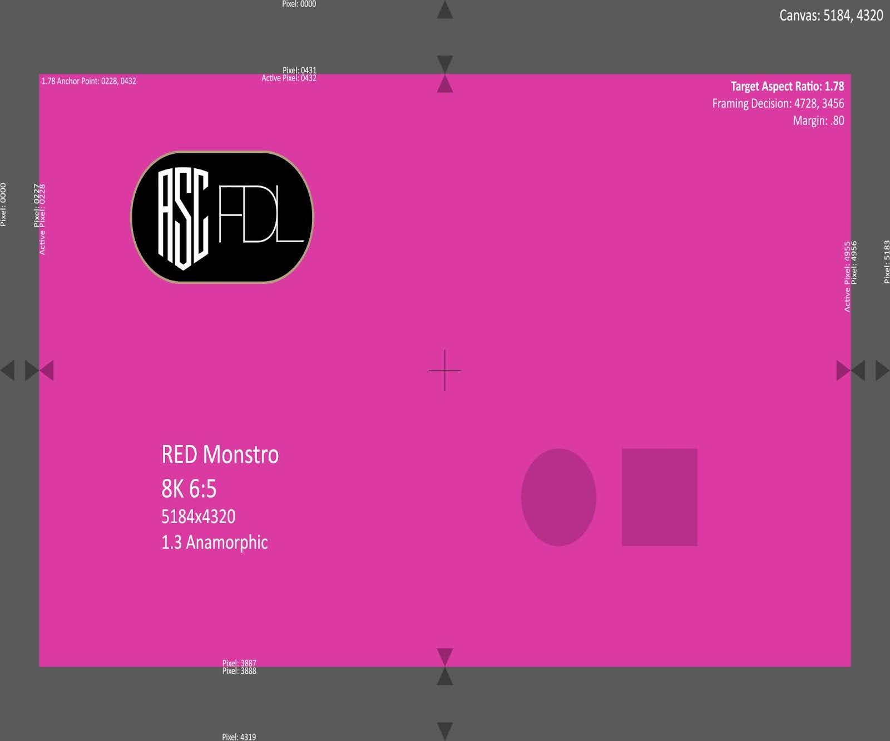 | 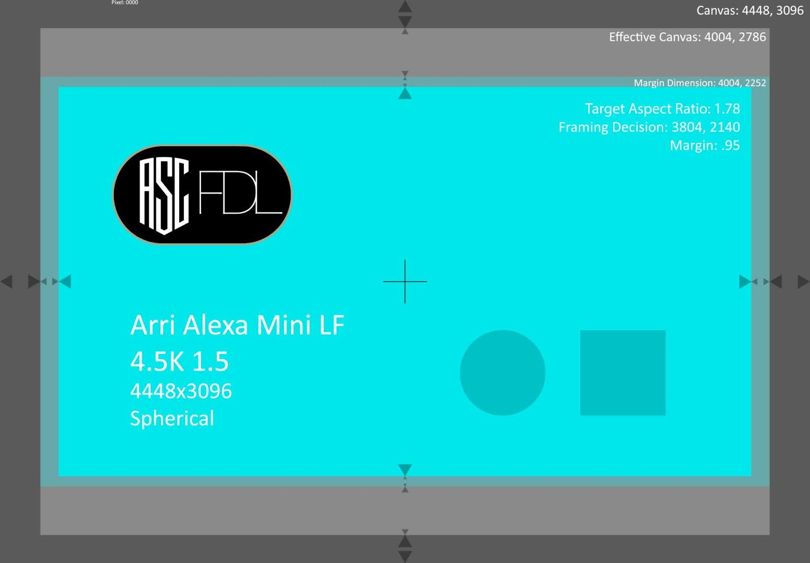 |  |
| **Result** |  | 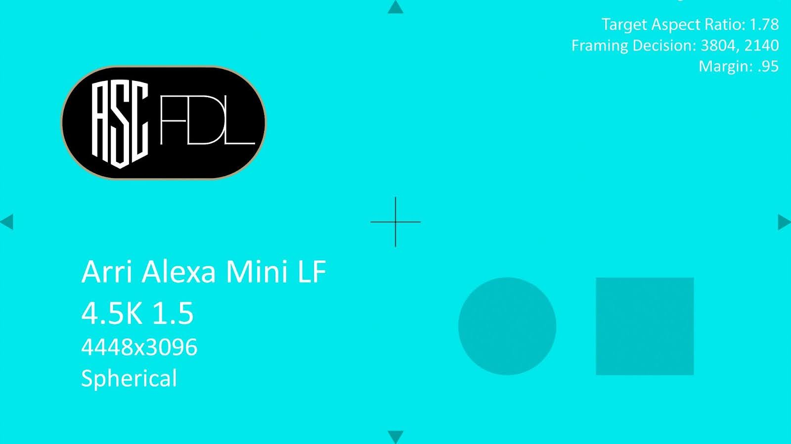 | 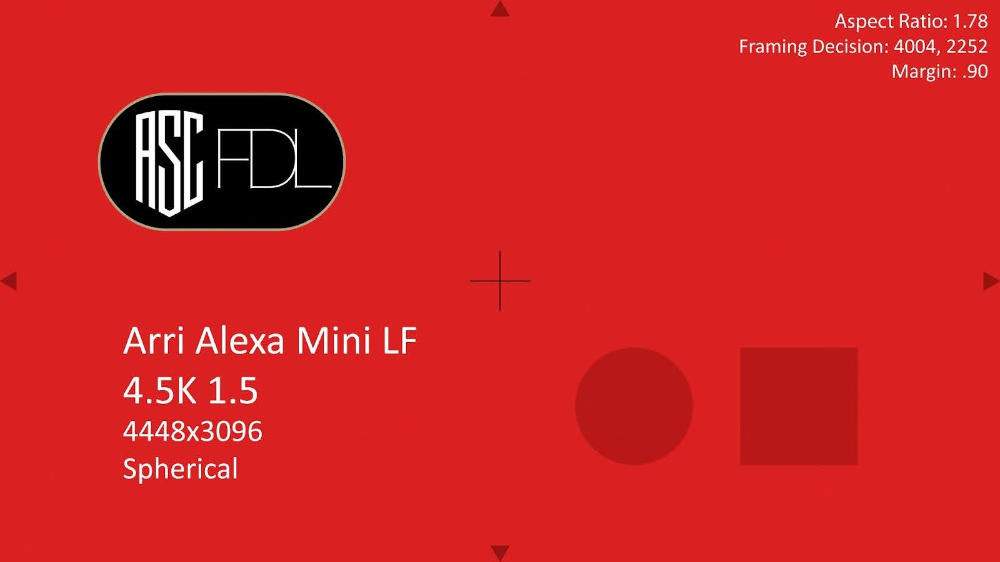 |

**Child Elements:** `label`, `id`, `target_dimensions`, `target_anamorphic_squeeze`, `fit_source`, `fit_method`, `alignment_method_vertical`, `alignment_method_horizontal`, `preserve_from_source_canvas`, `maximum_dimensions`, `pad_to_maximum`, `round`

### 7.4.1 Applying Canvas Templates

For `canvas_templates` to be used by any application, the application will need to know which source ASC FDL data (canvases, `framing_decisions`) it should be utilizing. It is not within scope of this specification to mandate how an implementation will request a user to point the application to specific FDLs for this source data.

The consistency of results between applications may depend on the order in which instructions are applied within `canvas_templates`. The reference implementation follows this high-level order of operations:

1. **Normalize**  `fit_source` and `target_dimensions`   
2. **Determine Scale Factor**  
3. **Determine new output** `canvases.dimensions`  
4. **Align new** `framing_decisions` **to new** `canvases.dimensions`  
5. **Crop/Pad if applicable**

For detailed information and recommended best practices, refer to the ASC FDL Implementation Guide.

### 7.4.2 label

The label field is a user defined field available to categorize and manage FDL data. For example: “VFX Pull”.

Note: Using UTF-8 strings with non-ASCII characters may have compatibility issues on some software. 

Example:
```json
"label": "VFX Pull"
```

Data Type: string

Required Field: No

### 7.4.3 id

The Canvas Template id field is meant to provide a means of identification. This id is not universally unique, but no other Canvas Template id within a single FDL will use the same id value. This id field shall be between 1-32 characters in length and will allow for use of alphanumeric characters and underscores.

Example:
```json
"id": "VX220310"
```

Data Type: string

Required Field: Yes

### 7.4.4 target_dimensions

`target_dimensions` are dimensions an input source is mapped into. `target_dimensions` may describe the final resulting dimensions of an output canvas, or a relative target inside an output canvas whose total dimensions are further defined by other attributes in the canvas template. When choosing a fit method of ‘all’ or ‘fill’, both height and width values of `target_dimensions` must be specified. 

When a user chooses to fit by height, the target width may be calculated by the application and not predefined by the user.  When choosing to fit by width, the target height may be calculated by the application and not predefined by the user. This means that the target width (or respectively, height) will be dynamically adjusted based on the `fit_source` aspect ratio.

Example:
```json
"target_dimensions": { "width": 3840, "height": 2160 }
```

Data Type:  
`"width": integer`  
`"height": integer`

Required Field: Yes

Units: Pixels

### 7.4.5 target_anamorphic_squeeze

`target_anamorphic_squeeze` field describes the resulting squeeze factor of the new canvas. The `canvases.anamorphic_squeeze` value of the input source must be converted to the value defined by `target_anamorphic_squeeze` in the canvas template. 

For example, if the `target_anamorphic_squeeze` is defined as 1.0 , an input source that has a `canvases.anamorphic_squeeze` value of 2.0 would be desqueezed to a value of 1.0. If another input source had a `canvases.anamorphic_squeeze` value of 1.3, it would also be desqueezed to a value of 1.0. An input sources with a `canvases.anamorphic_squeeze` value of 1.0 would remain 1.0.

If `target_anamorphic_squeeze` has a value of 0, the `canvases.anamorphic_squeeze` value of input sources should be preserved. For example, if an input source has a `canvases.anamorphic_squeeze` value of 2.00 , and the canvas template `target_anamorphic_squeeze` has a value of 0, the output canvas would retain a `anamorphic_squeeze` value of 2.00.

**Example:**

|  | Anamorphic Squeeze: 2.0 | Anamorphic Squeeze: 1.33 | Anamorphic Squeeze: 1.0 |
|--|---|---|---|
| **Source** |  |  |  |
| **Result** (Canvas Template Target Anamorphic Squeeze: 1.0) |  |  |  |

The input media file’s `canvases.anamorphic_squeeze` value must be defined in an associated ASC FDL in order for the `target_anamorphic_squeeze` attribute to work. 

Any application performing the process of generating new media assets and associated ASC FDL values will need to apply the `target_anamorphic_squeeze` factor before any fit operation (scaling). To ensure consistency between applications, the order of operations will be: **Desqueeze and then Scale.** 

`target_anamorphic_squeeze` formatting will follow the image deformation numbering system typically used by lens manufacturers. Example, 1.3 or 2.0. 

**Note:**  Any user interface used to manually specify pixel aspects should support at least 5 decimal place precision, to ensure that unsqueezed images are likely to be correct to the nearest pixel.

Example:
```json
"target_anamorphic_squeeze": 1.0
```

Data Type: float (equal to or greater than 0)

Required Field: Yes

### 7.4.6 fit_source

After defining `target_dimensions`, the user will need to choose which dimensions from the input source will be used to fit into the `target_dimensions`. Available values will be:

* `framing_decision.dimensions`
* `framing_decision.protection_dimensions`
* `canvas.dimensions`
* `canvas.effective_dimensions`

For example, choosing `target_dimensions` of: {"width": 3840, "height": 2160 } and a `fit_source` value of `framing_decisions.dimensions` would fit the `framing_decisions.dimensions` into `target_dimensions` of 3840 x 2160\.

When a template defines `fit_source`  as `canvas.dimensions`, if provided from the source canvas the `canvases.effective_dimensions` and `canvases.effective_anchor_point` values must also be recalculated and included in the output canvas.

If `fit_source` does not fill the `target_dimensions`, resulting in padding (such as pillarboxing or letterboxing) and the source Canvas did not include defined `canvases.effective_dimensions`, then the output Canvas must include new `canvases.effective_dimensions` and `canvases.effective_anchor_point` values based on the outer bounds of the active image area within `target_dimensions`.

Example:
```json
"fit_source": "framing_decision.dimensions"
```

Data Type: Enum

Required Field: Yes

Allowed Values:

* `framing_decision.dimensions`  
* `framing_decision.protection_dimensions`  
* `canvas.dimensions`  
* `canvas.effective_dimensions`

### 7.4.7 fit_method

The `fit_method` attribute specifies how to fit the `fit_source` selection into the `target_dimensions`.

Any implementation shall apply the `target_anamorphic_squeeze` factor before any Fit (scaling). Therefore the order of operations shall be: Desqueeze, then Fit (Scale).

If `preserve_from_source_canvas` is different than `fit_source`, then the output canvas dimensions may be larger than the `target_dimensions` to account for any additional protected area. In which case, the `effective_dimensions` of the output canvas should reflect the actual active pixels.

If the resulting output canvas dimensions must exactly equal the specified `target_dimensions` in the template, `maximum_dimensions` and `pad_to_maximum` should be specified within the template with `maximum_dimensions` values equaling `target_dimensions` and `pad_to_maximum` set to `true`. 

Values:  
**width**  
The selected `fit_source` attribute’s width value must be scaled to fit the width value of the `target_dimensions`, even if this results in the height value being larger or smaller than the height of the `target_dimensions`. This means that the target height dimension will be dynamically adjusted based on the source aspect ratio of the selected `fit_source`, to ensure the entire `fit_source` area is maintained. In implementations, when a user chooses to fit by width, the target height should be automatically calculated by the application and not predefined by the user.

Example:
```json
"target_dimensions": { "width": 3840, "height": 2160 },
"fit_source": "framing_decision.dimensions",
"fit_method": "width"
```

<table>
<tr>
<td><strong>Source</strong></td>
<td><strong>Result</strong></td>
</tr>
<tr>
<td></td>
<td></td>
</tr>
</table>

**height**  
The selected `fit_source` attribute’s height value must be scaled to fit the height value of the `target_dimensions`, even if this results in the source’s width value being larger or smaller than the width of the `target_dimensions`. This means that the target width dimension will be dynamically adjusted based on the `fit_source` aspect ratio, to ensure the entire `fit_source` area is maintained. In implementations, when a user chooses to fit by height, the target width should be automatically calculated by the application and not predefined by the user.

Example:
```json
"target_dimensions": { "width": 3840, "height": 2160 },
"fit_source": "framing_decision.dimensions",
"fit_method": "height"
```

<table>
<tr>
<td><strong>Source</strong></td>
<td><strong>Result</strong></td>
</tr>
<tr>
<td></td>
<td></td>
</tr>
</table>

**fit_all**
The selected `fit_source` attribute’s largest dimension value (width or height) must be scaled to fit within the defined `target_dimensions` in the template, even if this causes the other dimension to be smaller than either axis of the `target_dimensions` after scaling. This means that the `target_dimensions` should be dynamically adjusted based on the `fit_source` aspect ratio, to ensure the entire `fit_source` area is maintained. 

Example:
```json
"target_dimensions": { "width": 3840, "height": 2160 },
"fit_source": "framing_decision.dimensions",
"fit_method": "fit_all",
"maximum_dimensions": { "width": 3840, "height": 2160 },
"pad_to_maximum": true
```

<table>
<tr>
<td><strong>Source</strong></td>
<td><strong>Result</strong></td>
</tr>
<tr>
<td></td>
<td></td>
</tr>
</table>

**fill**  
The selected `fit_source` attribute’s smallest dimension value (width or height) must be scaled to fit within the defined `target_dimensions` in the template, even if this causes the other dimension to exceed the defined `target_dimensions` once scaled. This means that the `target_dimensions` should be dynamically adjusted based on the `fit_source` aspect ratio, to ensure the entire `fit_source` area is maintained.

Example:
```json
"target_dimensions": { "width": 3840, "height": 2160 },
"fit_source": "framing_decision.dimensions",
"fit_method": "fill",
"maximum_dimensions": { "width": 3840, "height": 2160 },
"pad_to_maximum": true
```

<table>
<tr>
<td><strong>Source</strong></td>
<td><strong>Result</strong> <em>(The sides of the framing decision are cut off)</em></td>
</tr>
<tr>
<td></td>
<td></td>
</tr>
</table>

Data Type: Enum

Required Field: Yes

Allowed Values: `width`, `height`, `fit_all`, `fill`

### 7.4.8 alignment_method

FDL Canvas Templates include two optional `alignment_method` attributes that together provide the ability to specifically offset the position of the `fit_source` vertically and horizontally inside the resulting canvas dimensions. The alignment is relative to the `target_dimensions`.

* `alignment_method_vertical`

* `alignment_method_horizontal`

### 7.4.8.1 alignment_method_vertical

`alignment_method_vertical` allows the ability to specifically offset the position of the `fit_source` vertically inside the defined `target_dimensions`.

Example:
```json
"alignment_method_vertical": "center"
```

Data Type: Enum

Required Field: No

Allowed Values: `top`, `center`, `bottom`

Default Value: `center`

### 7.4.8.2 alignment_method_horizontal

`alignment_method_horizontal` allows the ability to specifically offset the position of the `fit_source` horizontally inside the defined `target_dimensions`.

Example:
```json
"alignment_method_horizontal": "center"
```

Data Type: Enum

Required Field: No

Allowed Values: `left`, `center`, `right`

Default Value: `center`

### 7.4.9 preserve_from_source_canvas

`preserve_from_source_canvas` specifies additional area from the input source canvas to be preserved in the resulting canvas, outside of the `fit_source` selected from the input source to fit into the `target_dimensions`. The output canvas dimensions may extend beyond the `target_dimensions` as a result. 

If `preserve_from_source_canvas` results in a canvas larger than the specified `target_dimensions`, the resulting canvas dimensions shall extend to fit the area defined by `preserve_from_source_canvas`, maintaining the relative position and scale to the `fit_source` area within. 

Because `preserve_from_source_canvas` defines dimensions to preserve into the resulting canvas in excess of `fit_source` dimensions, it must define dimensions that exceed `fit_source` to have any effect on the results.

If `preserve_from_source_canvas` is defined as `canvas.dimensions` in the template, and `canvases.effective_dimensions` and `canvases.effective_anchor_point` existed, these must also be respected, re-calculated, and included in the output canvas.

Similarly, if the use of `preserve_from_source_canvas` does not fill the resulting canvas dimensions, resulting in padding, the output canvas must specify new `effective_dimensions` and `effective_anchor_point` values based on the outer bounds of the active image area within resulting canvas.

For example, here is a source image with defined Canvas and Framing Decision values:


In the example above, the source Canvas has `canvas.dimensions` of {"width": 4448, "height": 3096} and `framing_decision.dimensions` values of {"width": 4004, "height": 2252}. Using a Canvas Template, the user may choose to fit `framing_decision.dimensions` into the `target_dimensions` of {"width": 3840, "height": 2160}. The user may also now use `preserve_from_source_canvas` to define whether to preserve the additional image area outside of `framing_decision.dimensions`, or exclude it. 

Here is an example if the user had chosen `framing_decision.dimensions` as the `preserve_from_source_canvas`  value:

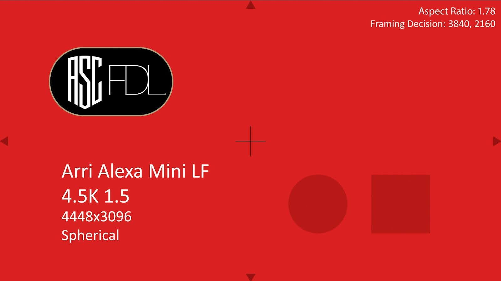

No image area from the source canvas is preserved outside of the `framing_decision.dimensions` and the resulting Canvas remains 3840 x 2160\. If the user had chosen `canvas.dimensions` instead, with default round logic, the resulting Canvas would have expanded outward, resulting in a new `canvas.dimensions` values of 4266 x 2970\.

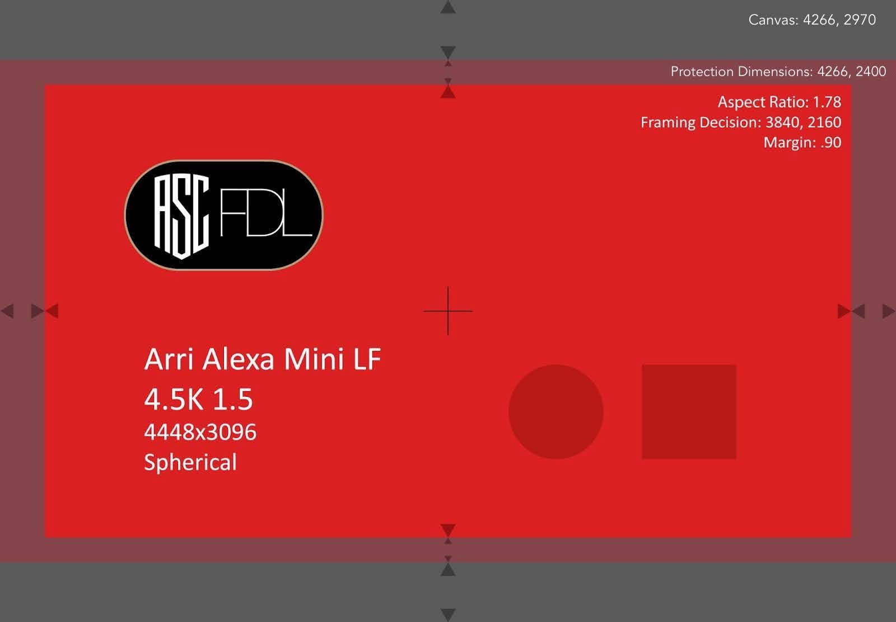

Example:
```json
"preserve_from_source_canvas": "canvas.dimensions"
```

Data Type: Enum

Required Field: No

Allowed Values:

* `framing_decision.dimensions`  
* `framing_decision.protection_dimensions`  
* `canvas.dimensions`  
* `canvas.effective_dimensions`

Default Value: Omitted

### 7.4.10 maximum_dimensions

The `maximum_dimensions` attribute specifies maximum height and width dimensions for a newly minted canvas. 

`maximum_dimensions` shall always take priority over `preserve_from_source` and `target_dimensions` results, and does not have any requirements on the aspect ratio utilized.

A `maximum_dimensions` must always be greater or equal to the `target_dimensions`.

In the example used above for the `preserve_from_source` attribute, if a user had chosen to preserve the `canvas.dimensions`, but also set the `maximum_dimensions` to {"width": 4096, "height": 2160}, the resulting Canvas would have been cropped (not scaled) to 4096 x 2160\.

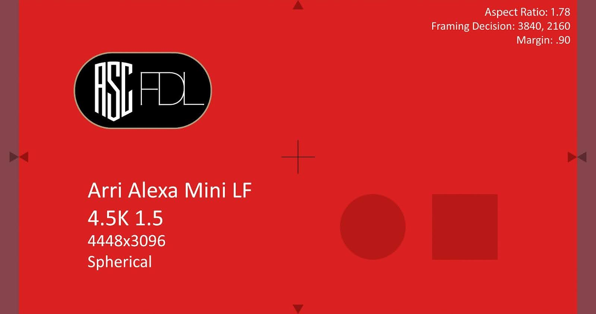

However, if `maximum_dimensions`, is omitted, the dimensions of the resulting Canvas would not have been cropped.

Example, with the same source image, Canvas Template `maximum_dimensions` values of {"width": 5000, "height": 3496} the resulting Canvas dimensions would still remain 4266 x 2970, as this attribute does not force any kind of scaling, and the dimensions do not meet or exceed the `maximum_dimensions` values.


Example:
```json
"maximum_dimensions": { "width": 5000, "height": 3496 }
```

Data Type:  
`"width": integer`  
`"height": integer`

Required Field: No

Default Value: Omitted

### 7.4.11 pad_to_maximum

As specified in section 7.4.10, `maximum_dimensions` only ensures that a Canvas is no larger than its specified height and width values. Therefore, the dimensions and alignment of the resulting `target_dimensions` to resulting canvases from different input sources could vary if they do not exceed the specified `maximum_dimensions`. With a `pad_to_maximum` value of true, the resulting canvas shall fill the height and width values noted in `maximum_dimensions`. The `target_dimensions` should center-align to the resulting canvas. 

`pad_to_maximum` pads out to `maximum_dimensions` in the resulting canvas, adding pillarboxing, letterboxing, or postage stamping if needed. It is not a scaling operation

If the output canvas includes padding as a result of `pad_to_maximum`, and the source canvas did not include defined `effective_dimensions`, the output canvas must specify new `effective_dimensions` and `effective_anchor_point` values based on the outer bounds of the active image area within `maximum_dimensions`.

Example: Here is a source image file, which has a `canvas.dimensions` of {"width": 4448, "height": 3096:  
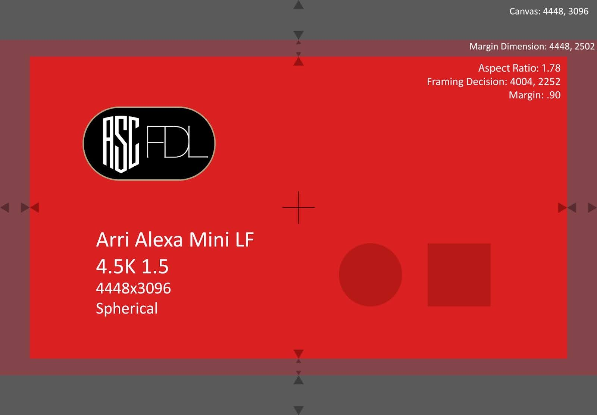

The user has chosen the following values in their Canvas Template:

```json
"target_dimensions": { "width": 3840, "height": 2160 },
"target_anamorphic_squeeze": 1.0,
"fit_source": "framing_decision.dimensions",
"fit_method": "width",
"alignment_method_vertical": "center",
"alignment_method_horizontal": "center",
"preserve_from_source_canvas": "canvas.dimensions",
"maximum_dimensions": { "width": 5000, "height": 3496 }
```

With `pad_to_maximum` field set to false, the resulting Canvas dimensions would be  {"width": 4266, "height": 2970} and not forced to match the values defined in `maximum_dimensions`.


If the `pad_to_maximum` was set to true, the resulting Canvas is {"width": 5000, "height": 3496} with the resulting image both pillarboxed and letterboxed, considering the `pad_to_maximum` pads instead of forcing any scaling:

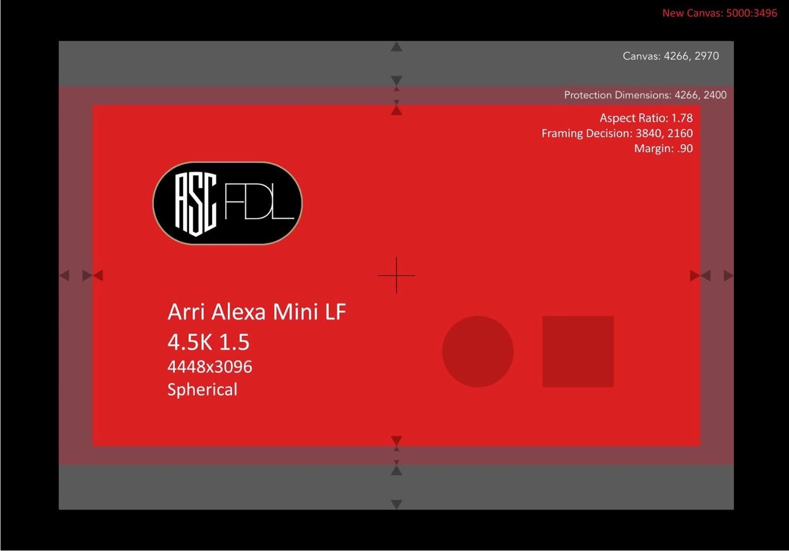

If `maximum_dimensions` is omitted or its values are blank, `pad_to_maximum` shall be disregarded.

Example:
```json
"pad_to_maximum": true
```

Data Type: boolean

Required Field: No

Default Value: `false`

### 7.4.12 round

`round` is a pad or crop function used to refine the calculated height and width values of an output canvas’ `canvas.dimensions`. 

`round` is only applicable to the `canvas.dimensions` of the output canvas and shall not affect calculated `fit_source`, `target_dimensions`, nor `target_anamorphic_squeeze` values.

If `maximum_dimensions` is defined and `pad_to_maximum` = true,  then `round` has no effect due to `maximum_dimensions` already being defined.

Users may want to control whether a newly minted canvas’ `canvas.dimensions` are allowed to contain odd-number values, or force any newly created Canvas values to be even numbers. Different platforms handle rounding in different ways, so defining the rounding “rules” ensures consistency in scaling behavior between platforms. Rounding is one of the key variables that can be defined within a Canvas Template to ensure consistent results.

1st Enum ("even") values:

**whole** = round value to the **nearest integer** following the method defined by the "mode"

**even** = round value to **nearest even-numbered integer** following the method defined by the "mode"

2nd Enum ("mode") values:

**up** = always round **up**

**down** = always round **down**

**round** = round to the **nearest** integer defined by the "even" attribute

Example round logic for canvas height with float value of 1608.75:

```json
[
  {"round": { "even": "even", "mode": "round" },"result": 1608},
  {"round": { "even": "even", "mode": "up" },"result": 1610},
  {"round": { "even": "even", "mode": "down" },"result": 1608},
  {"round": { "even": "whole", "mode": "round" },"result": 1609},
  {"round": { "even": "whole", "mode": "up" },"result": 1609},
  {"round": { "even": "whole", "mode": "down" },"result": 1608}
]
```

Data Type:  
`"even": Enum`  
`"mode": Enum`

Allowed Values for 1st Enum (‘even’): `whole`, `even`

Allowed Values for 2nd Enum (‘mode’): `up`, `down`, `round`

Required Field: No

Default Value: `"even": "even"`, `"mode": "up"`

# 8. Appendix

## Appendix A: Example ASC FDL

```json
{
  "uuid": "BCD142EB-3BAA-4EA8-ADD8-A46AE8DC4D97",
  "version": { "major": 2, "minor": 0 },
  "fdl_creator": "ASC FDL Committee",
  "default_framing_intent": "FDLSMP01",
  "framing_intents": [
    {
      "label": "2-1 Framing",
      "id": "FDLSMP01",
      "aspect_ratio": { "width": 2, "height": 1 },
      "protection": 0.1
    }
  ],
  "contexts": [
    {
      "label": "ArriLF",
      "context_creator": "ASC FDL Committee",
      "canvases": [
        {
          "label": "Open Gate RAW",
          "id": "20220310",
          "source_canvas_id": "20220310",
          "dimensions": { "width": 4448, "height": 3096 },
          "effective_dimensions": { "width": 4448, "height": 3096 },
          "effective_anchor_point": { "x": 0.0, "y": 0.0 },
          "photosite_dimensions": { "width": 4448, "height": 3096 },
          "physical_dimensions": { "width": 36.7, "height": 25.54 },
          "anamorphic_squeeze": 1.0,
          "framing_decisions": [
            {
              "label": "2-1 Framing",
              "id": "20220310-FDLSMP01",
              "framing_intent_id": "FDLSMP01",
              "dimensions": { "width": 4004.0, "height": 2002.0 },
              "anchor_point": { "x": 222.0, "y": 547.0 },
              "protection_dimensions": { "width": 4448.0, "height": 2224.0 },
              "protection_anchor_point": { "x": 0.0, "y": 436.0 }
            }
          ]
        }
      ]
    }
  ]
}
```

## Appendix B: Example ASC FDL JSON File With 2 Framing Decisions

```json
{
  "uuid": "DEAF6B84-6B8C-46DB-8CE3-DA5DAB8C9817",
  "version": { "major": 2, "minor": 0 },
  "fdl_creator": "Jane Doe",
  "default_framing_intent": "29A901F1",
  "framing_intents": [
    {
      "label": "Hero 1.78",
      "id": "29A901F1",
      "aspect_ratio": { "width": 16, "height": 9 },
      "protection": 0.05
    },
    {
      "label": "Hero 2-1",
      "id": "0302684B",
      "aspect_ratio": { "width": 2, "height": 1 },
      "protection": 0.05
    }
  ],
  "contexts": [
    {
      "label": "ArriLF",
      "context_creator": "Arri LF",
      "canvases": [
        {
          "label": "Open Gate ARRIRAW",
          "id": "20210902",
          "source_canvas_id": "20210902",
          "dimensions": { "width": 4448, "height": 3096 },
          "effective_dimensions": { "width": 4448, "height": 3096 },
          "effective_anchor_point": { "x": 0, "y": 0 },
          "photosite_dimensions": { "width": 4448, "height": 3096 },
          "physical_dimensions": { "width": 36.7, "height": 25.54 },
          "anamorphic_squeeze": 1.0,
          "framing_decisions": [
            {
              "label": "Hero 1.78",
              "id": "20210902-29A901F1",
              "framing_intent_id": "29A901F1",
              "dimensions": { "width": 4226.0, "height": 2376.0 },
              "anchor_point": { "x": 111.0, "y": 360.0 },
              "protection_dimensions": { "width": 4448.0, "height": 2508.0 },
              "protection_anchor_point": { "x": 0.0, "y": 294.0 }
            },
            {
              "label": "Hero 2-1",
              "id": "20210902-0302684B",
              "framing_intent_id": "0302684B",
              "dimensions": { "width": 4224.0, "height": 2112.0 },
              "anchor_point": { "x": 112.0, "y": 492.0 },
              "protection_dimensions": { "width": 4448.0, "height": 2224.0 },
              "protection_anchor_point": { "x": 0.0, "y": 436.0 }
            }
          ]
        }
      ]
    }
  ]
}
```

## Appendix C: Example ASC FDL JSON File with only Canvas Templates

```json
{
  "uuid": "3E9F94EF-A910-470D-8EC4-B14E551AC6AB",
  "version": { "major": 2, "minor": 0 },
  "fdl_creator": "The Camera",
  "default_framing_intent": "FDLSMP05",
  "framing_intents": [
    {
      "label": "2.39 Framing",
      "id": "FDLSMP05",
      "aspect_ratio": { "width": 2048, "height": 858 },
      "protection": 0.1
    }
  ],
  "canvas_templates": [
    {
      "label": "VFX Pull",
      "id": "VX220310",
      "target_dimensions": { "width": 4096, "height": 1716 },
      "target_anamorphic_squeeze": 1.0,
      "fit_source": "framing_decision.dimensions",
      "fit_method": "width",
      "alignment_method_vertical": "center",
      "alignment_method_horizontal": "center",
      "preserve_from_source_canvas": "canvas.dimensions",
      "round": { "even": "even", "mode": "up" }
    },
    {
      "label": "Editorial Dailies",
      "id": "ED220310",
      "target_dimensions": { "width": 1920, "height": 1080 },
      "target_anamorphic_squeeze": 1.0,
      "fit_source": "framing_decision.dimensions",
      "fit_method": "width",
      "alignment_method_vertical": "center",
      "alignment_method_horizontal": "center",
      "preserve_from_source_canvas": "framing_decision.dimensions",
      "round": { "even": "even", "mode": "up" }
    }
  ]
}
```

## Appendix D: Example ASC FDL JSON File with Effective Canvas

```json
{
  "uuid": "5EDD03DC-4EFF-42BB-8085-DDECC3036982",
  "version": { "major": 2, "minor": 0 },
  "fdl_creator": "ASC FDL Committee",
  "default_framing_intent": "FDLSMP04",
  "framing_intents": [
    {
      "label": "2-1 Framing",
      "id": "FDLSMP04",
      "aspect_ratio": { "width": 2, "height": 1 },
      "protection": 0.05
    }
  ],
  "contexts": [
    {
      "label": "ArriLFV",
      "context_creator": "ASC FDL Committee",
      "canvases": [
        {
          "label": "Open Gate Vignette",
          "id": "20220311",
          "source_canvas_id": "20220311",
          "dimensions": { "width": 4448, "height": 3096 },
          "effective_dimensions": { "width": 4004, "height": 2786 },
          "effective_anchor_point": { "x": 222.0, "y": 155.0 },
          "photosite_dimensions": { "width": 4448, "height": 3096 },
          "physical_dimensions": { "width": 36.7, "height": 25.54 },
          "anamorphic_squeeze": 1.0,
          "framing_decisions": [
            {
              "label": "2-1 Framing",
              "id": "20220311-FDLSMP04",
              "framing_intent_id": "FDLSMP04",
              "dimensions": { "width": 3804.0, "height": 1902.0 },
              "anchor_point": { "x": 322.0, "y": 597.0 },
              "protection_dimensions": { "width": 4004.0, "height": 2002.0 },
              "protection_anchor_point": { "x": 222.0, "y": 547.0 }
            }
          ]
        }
      ]
    }
  ]
}

```

## Appendix E: Example ASC FDL JSON File with Clip IDs

```json
{
  "uuid": "5EDD03DC-4EFF-42BB-8085-DDECC3036982",
  "version": { "major": 2, "minor": 0 },
  "fdl_creator": "ASC FDL Committee",
  "default_framing_intent": "FDLSMP04",
  "framing_intents": [
    {
      "label": "2-1 Framing",
      "id": "FDLSMP04",
      "aspect_ratio": { "width": 2.0, "height": 1.0 },
      "protection": 0.05
    }
  ],
  "contexts": [
    {
      "label": "ArriLFV_Movie",
      "context_creator": "ASC FDL Committee",
      "clip_id": {
        "clip_name": "A002_C307_0523JT",
        "file": "A002_C307_0523JT.MOV"
      },
      "canvases": [
        {
          "label": "Open Gate Vignette",
          "id": "20220311_V01",
          "dimensions": { "width": 4448, "height": 3096 },
          "effective_dimensions": { "width": 4004, "height": 2786 },
          "effective_anchor_point": { "x": 222.0, "y": 155.0 },
          "photosite_dimensions": { "width": 4448, "height": 3096 },
          "physical_dimensions": { "width": 36.7, "height": 25.54 },
          "anamorphic_squeeze": 1.0,
          "framing_decisions": [
            {
              "label": "2-1 Framing",
              "id": "20220311-FDLSMP04",
              "framing_intent_id": "FDLSMP04",
              "dimensions": { "width": 3804.0, "height": 1902.0 },
              "anchor_point": { "x": 322.0, "y": 597.0 },
              "protection_dimensions": { "width": 4004.0, "height": 2002.0 },
              "protection_anchor_point": { "x": 222.0, "y": 547.0 }
            }
          ]
        }
      ]
    },
    {
      "label": "ArriLFV_Sequence",
      "context_creator": "ASC FDL Committee",
      "clip_id": {
        "clip_name": "A003_C307_0523JT",
        "sequence": {
          "value": "A003_C307_0523JT_###.exr",
          "idx": "#",
          "min": 0,
          "max": 100
        }
      },
      "canvases": [
        {
          "label": "Open Gate Full",
          "id": "20220311_V02",
          "dimensions": { "width": 4448, "height": 3096 },
          "effective_dimensions": { "width": 4448, "height": 3096 },
          "effective_anchor_point": { "x": 0.0, "y": 0.0 },
          "photosite_dimensions": { "width": 4448, "height": 3096 },
          "physical_dimensions": { "width": 36.7, "height": 25.54 },
          "anamorphic_squeeze": 1.0,
          "framing_decisions": [
            {
              "label": "2-1 Framing",
              "id": "20220311-FDLSMP04_SEQ",
              "framing_intent_id": "FDLSMP04",
              "dimensions": { "width": 4224.0, "height": 2112.0 },
              "anchor_point": { "x": 112.0, "y": 492.0 },
              "protection_dimensions": { "width": 4448.0, "height": 2224.0 },
              "protection_anchor_point": { "x": 0.0, "y": 436.0 }
            }
          ]
        }
      ]
    }
  ]
}
```

## Appendix F: ASC FDL Represented in an ALE

A user may choose to communicate which ASC FDL should be applied to which shot through a metadata exchange file such as an ALE. There are two columns and values that should be provided in an ALE in order for any application to know which FDL to apply to any given shot:

| Column | Value | Type | Required | Descriptions |
| :---- | :---- | :---- | :---- | :---- |
| **fdl-uuid** | `uuid` | string | Yes | Unique identifier of the associated ASC FDL document (UUID format). |
| **fdl-framing-decision-id** | `framing_decisions.id` | string  | Yes | The matching `framing_decisions.id` within the associated ASC FDL document. |

## Appendix G: ASC FDL Data Placed within the header of a file

A user may choose to communicate which ASC FDL should be applied to which shot by adding the necessary FDL info directly into the metadata header of a rendered file. 

The preferred implementation is to insert the entirety of the ASC FDL data structure into the file, and JSON was chosen in part for its compatibility with this type of implementation. 

**Example**: ASC FDL as JSON-encoded data is a standard attribute within the OpenEXR file format:

| Attribute name | Type | Definition |
| :---- | :---- | :---- |
| **ascFramingDecisionList** | string | JSON-encoded description of framing decisions associated with the captured image, in a format termed 'ASC-FDL', designed and documented by the American Society of Cinematographers (ASC). If present, the value should be UTF-8-encoded and have a nonzero length. |

If the full ASC FDL JSON data structure cannot be fully placed within a file, there are two key pieces of data that should be shared in order for any application to know which FDL to apply to any given shot:

1. **fdl-uuid**  
2. **fdl-framing-decision-id**

The **fdl-uuid** field will be able to tell any application down stream which ASC FDL file to use for that particular shot. Whereas the **fdl-framing-decision-id**, will tell the application which specific frame within the FDL to use. 

## Appendix H: ASC FDL Represented in an EDL

A user may choose to communicate which ASC FDL should be applied to which shot by adding the necessary FDL info to the comments section of an EDL. There are two key pieces of data that should be shared in order for any application to know which FDL to apply to any given shot:

| EDL Field | ASC FDL Value | Type | Required | Descriptions |
| :---- | :---- | :---- | :---- | :---- |
| **FDL-UUID** | `uuid` | string | Yes | Unique identifier of the associated ASC FDL document (UUID format). |
| **FDL-FRAMING_DECISION-ID** | `framing_decisions.id` | string  | Yes | The matching `framing_decisions.id` within the associated ASC FDL document. |

The formatting of these values should be as follows:

```
* FDL-UUID: value
* FDL-FRAMING-DECISION-ID: value
```

Example:
```
* FDL-UUID: BCD142EB-3BAA-4EA8-ADD8-A46AE8DC4D97
* FDL-FRAMING-DECISION-ID: 20220310-FDLSMP01
```

COPYRIGHT  
All rights reserved to American Society of Cinematographers. Users may only use the credit required for the purpose of attribution, and may not assert or imply any connection with, sponsorship, or endorsement by ASC, without ASC separate, express prior written permission.

TRADEMARK  
ASC FDL™ is a trademark of American Society of Cinematographers.

DISCLAIMER  
American Society of Cinematographers is not liable for any damages, including direct or consequential, from the use of ASC FDL specification outlined in this document.

LICENSING  
This specification is made available under MIT License stated here - [https://github.com/git/git-scm.com/blob/main/MIT-LICENSE.txt](https://github.com/git/git-scm.com/blob/main/MIT-LICENSE.txt)

NOTICE  
For any further explanation of the contents of this document, or in case of any perceived inconsistency or ambiguity of interpretation, please contact American Society of Cinematographers at: [ascfdl.feedback@gmail.com](mailto:ascfdl.feedback@gmail.com)

